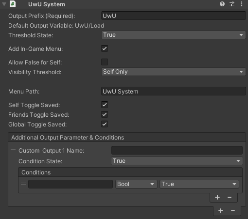
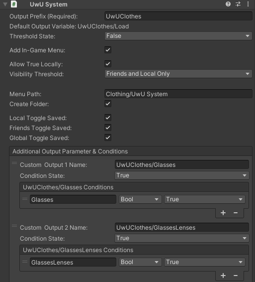
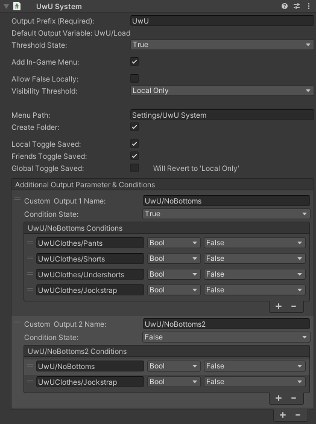

# Unseen without Untoggling (UwU) System

Adds a unity component that integrates with VRCFury to easily create parameters that toggle on and off based on the built-in IsLocal and IsOnFriendsList parameters as well as other customizable conditions.

## ▶ Getting Started

* Go to [This Link](https://Myrddin714.github.io/UwU_System)
to add this repository to your VCC or ALCOM.
  * Add this repository to your Unity project.
  * Choose or create an object in your avatar hierarchy.
  * Click the 'Add Component' button in the inspector window and select 'UwU System'.
  * Enter a Parameter `Output Prefix` in the first textbox.
  * Set other settings as desired (See below for details).
That's it. You can use the Parameters made by this component to trigger custom logic on your avatar (Examples below)

## 🔒 Requirements

* VRCFury is required for this package to work. Refer to the [VRCFury Website](https://vrcfury.com/download) for instructions on adding it to your project.
* The `Output Prefix` field is required and must be unique per avatar. If duplicates are found only one will be built.

## 🤖 Customizing the Component

Customizing the UwU System has many different options to allow you to tailor it to your use case.

* `Output Prefix (Required):` The prefix for the `Default Output Variable` as well as a name for the files and other variables needed for the UwU System to work. If this is left blank, the component will do nothing.
  * `Default Output Variable:` Displays the name of the parameter that will be used as the starting point of the logic for the rest of the System, but can also be used by itself more simple setups. The name is always `Output Prefix`/Load.
* `Threshold State:` This is the resulting value of the `Default Output Variable` when within the `Visibility Threshold`. Default is "true".
* `Add In-Game Menu:` Adds a menu at the path specified in `Menu Path`. Default is "true".
* `Allow False/True for Self:` Allows the UwU System to be "turned off". Adds a "None" option to the `Visibility Threshold` list. Name depends on the setting of `Threshold State` above. Default is "false".
* `Visibility Threshold:` Changes the situations when the `Default Output Variable` will be the value set in `Threshold State`. Possible entries are "Self Only", "Friends and Self Only", and "Everyone".
* `Menu Path:` Only visible if `Add In-Game Menu` is checked. Allows setting the in-game menu to a custom path in your avatar's expression menu. Subfolders are indicated with a `/`. Default is "UwU System".
* `Self/Friends/Global Toggle Saved:` Only visible if `Add In-Game Menu` is checked. Allows the Self, Friends, and Global toggle of the in-game menu to be saved between worlds.
* `Additional Output Parameters & Conditions`: Optional settings that allow for more custom parameters to be made with optional custom conditions for more advanced setups.
  * `Custom Output # Name:` Allows setting the name of a custom parameter as an output
  * `Condition State:` Allows setting the state of the Output parameter when the `Default Output Variable` and the Conditions set below it (if any) are true. Default is "true".
  * `Conditions`: List of conditions for the `Custom Output # Name`
    * Enter the Name, Type, and desired value of Parameter(s)

That's it!
Some other notes:
* Currently condition parameters have to be unique per custom output parameter.

## 📃 Examples

### Example 1

* Setting the `Threshold State` to "False" along with having the `Allow True for Self` to off and the `Visibility Threshold` to "Friends and Self Only" means that the output is only true for nonfriends, but can be set to more, including being set to "None" which actually means that it would be on for every one.
* The `Additional Output Parameter & Conditions` actually has 16 custom outputs, but they all follow a similar format as the ones shown.
  * In the first example, the condition "Glasses" is tied to the menu option on the avatar and is exclusive with "GlassesLenses" (because of how the animations they are designed for work) but does nothing else. The parameter "UwUClothes/Glasses" is tied to the animation that turns the glasses on for the avatar.
* The result of all this is that the "Glasses" menu option on the avatar will turn on the glasses for the avatar, but will only be visible by nonfriends by default, but can be set to be visible to friends as well by setting the `Visibility Threshold` to "Self Only" or be visible to everyone by toggling off the system from the "Clothing/UwU System" menu path of the avatar.

### Example 2

* With the `Global Toggle Saved` being off, if the `Visibility Threshold` is set to "global" with the in-game menu at "Settings/UwU System", it be reset to "Self Only" when the avatar is reloaded or when loading into a different world.
* The first custom output parameter "UwU/NoBottom" is only true when all the different pieces of bottom clothing on my avatar are toggled off. Note the conditions for this output are actually outputs from the component from Example 1, meaning that this output will adjust based on the Visiblity threshold of the other UwU System component.
* The second custom output parameter "UwU/NoBottom2" has the `Condition State` set to false, as well as using the first custom output as a condition for the second output parameter. The result is that it works as almost the same as UwU/NoBottoms, but UwUClothes/Jockstrap will not turn it off.

## 💻 Technical Stuff

You are welcome to make your own changes to the automation process to make it fit your needs, and you can create Pull Requests if you have some changes you think we should adopt. Here's some more info on the included automation:

### Build Release Action
[release.yml](/.github/workflows/release.yml)

This is a composite action combining a variety of existing GitHub Actions and some shell commands to create both a .zip of your Package and a .unitypackage. It creates a release which is named for the `version` in the `package.json` file found in your target Package, and publishes the zip, the unitypackage and the package.json file to this release.

### Build Repo Listing
[build-listing.yml](.github/workflows/build-listing.yml)

This is a composite action which builds a vpm-compatible [Repo Listing](https://vcc.docs.vrchat.com/vpm/repos) based on the releases you've created. In order to find all your releases and combine them into a listing, it checks out [another repository](https://github.com/vrchat-community/package-list-action) which has a [Nuke](https://nuke.build/) project which includes the VPM core lib to have access to its types and methods. This project will be expanded to include more functionality in the future - for now, the action just calls its `BuildRepoListing` target.
